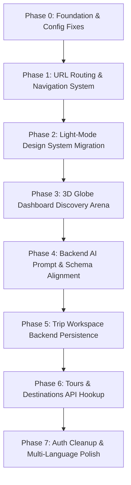

# 📋 TripMind — Current Implementation Audit & Specification Alignment

> **Document Status**: OFFICIAL IMPLEMENTATION AUDIT & GAP ANALYSIS  
> **Role**: LEAD ENGINEER, TRIPMIND PLATFORM  
> **Target Version**: TripMind 2.0 (Global AI-Powered Travel Platform & Tour Ecosystem)  
> **Date**: October 5, 2026  
> **Operating Constraint**: Strict Non-Destructive Audit — Architecture & Gap Analysis Phase  
> **Canonical References**:
> - [`docs/product/TRIPMIND_PRODUCT_ARCHITECTURE.md`](file:///Users/shoabbosovamuslima/Desktop/Travel%20uz/docs/product/TRIPMIND_PRODUCT_ARCHITECTURE.md)
> - [`docs/product/TRIPMIND_UX_SPEC.md`](file:///Users/shoabbosovamuslima/Desktop/Travel%20uz/docs/product/TRIPMIND_UX_SPEC.md)
> - [`docs/product/TRIPMIND_DESIGN_ALIGNMENT.md`](file:///Users/shoabbosovamuslima/Desktop/Travel%20uz/docs/product/TRIPMIND_DESIGN_ALIGNMENT.md)
> - [`docs/product/TRIPMIND_3D_GLOBE_SPEC.md`](file:///Users/shoabbosovamuslima/Desktop/Travel%20uz/docs/product/TRIPMIND_3D_GLOBE_SPEC.md)
> - [`docs/audit/TRIPMIND_CODEBASE_AUDIT.md`](file:///Users/shoabbosovamuslima/Desktop/Travel%20uz/docs/audit/TRIPMIND_CODEBASE_AUDIT.md)
> - Root Architecture: [`package.json`](file:///Users/shoabbosovamuslima/Desktop/Travel%20uz/package.json), [`API_CONTRACT.md`](file:///Users/shoabbosovamuslima/Desktop/Travel%20uz/API_CONTRACT.md), [`backend/app/main.py`](file:///Users/shoabbosovamuslima/Desktop/Travel%20uz/backend/app/main.py)

---

## 1. Executive Summary & Purpose

This audit evaluates the current implementation in `/Users/shoabbosovamuslima/Desktop/Travel uz` directly against the approved TripMind product architecture, UI/UX specifications, 3D Globe guidelines, and visual design standards.

Recent engineering has successfully established the core traveler components:
- **`AiPlannerWizard`**: Filter-first baseline inputs, conversational tradeoff questions, tri-tier strategy cards, and milestone progress generation.
- **`TripDetailsView`**: Trip Workspace with Timeline, Hourly Calendar, synchronized Map, In-Trip AI Adaptation drawer, and embedded Ready Tours.
- **`ReadyToursSection`** & **`TripCompareModal`**: Vetted tour packages with inclusion checklists, direct agency quote modal, and 8-dimension comparison matrix.
- **`CurrencyContext`**: Universal currency engine supporting USD, EUR, UZS, GBP, and JPY with localStorage persistence and real-time formatting.
- **`TripMap`**: Reusable dark-mode map container with zero hardcoded API keys, interactive vector SVG fallback with numbered route waypoints, and Google Maps JS SDK loading.
- **`Dashboard`**: TripMind branding, responsive desktop top bar, and 5-tab mobile bottom navigation.

However, significant architectural, stylistic, and integration discrepancies remain between the current code and the final TripMind specifications. This document classifies every major area of the application into **KEEP**, **REFACTOR**, **REPLACE**, and **MISSING**, and outlines the safe, non-destructive sequence for bringing the repository into full compliance.

---

## 2. Classification Schema

| Classification | Definition & Action Rule |
| :--- | :--- |
| **`KEEP`** | **Production-Ready / High-Value**: Conforms to TripMind specifications or provides essential business logic (e.g. 3D flight arcs, B2B CRM pipeline, JWT auth, database relational schema). Preserve without breaking changes. |
| **`REFACTOR`** | **Architecturally Sound, Needs Alignment**: Solid foundation, but requires visual alignment (e.g. converting dark glassmorphism to modern light-mode `#F8FAFC`), URL router migration, or live backend endpoint hookups. |
| **`REPLACE`** | **Anti-Pattern / Technical Debt**: Violates production requirements (e.g. fake client-side OAuth stubs, hardcoded mock arrays that bypass existing backend tables, synthetic math coordinate offsets). Replace with standards-compliant implementations. |
| **`MISSING`** | **Specification Gap**: Core TripMind functionality required by the product specs that is currently absent (e.g. deterministic URL routing, backend package search API, bookmark sync API, live weather proxy). Needs implementation. |

---

## 3. High-Level Subsystem Classification Matrix

| Subsystem / Area | Current File(s) | Status | Target Specification Alignment |
| :--- | :--- | :---: | :--- |
| **Design System & Theme Tokens** | `src/index.css`, `src/App.css` | **REFACTOR** | Migrate default canvas to modern light-mode (`#F8FAFC` base, `#FFFFFF` surfaces, `#0F172A` text, `#2563EB` blue accent, crisp 1px borders, Outfit/Inter typography). Keep dark theme as toggleable option. |
| **URL Navigation & Routing** | `src/App.tsx`, `src/pages/Dashboard.tsx` | **REPLACE** | Replace client-side component state machine (`dashboardView`) with deterministic browser URL routing (`/explore`, `/planner`, `/trips/:id`, `/tours`, `/saved`) to support browser back/forward, deep-linking, and SEO. |
| **3D Interactive Globe Engine** | `src/components/Globe3D.tsx`, `GlobeScene.tsx`, `FlightPathAnimation.tsx` | **KEEP** | Photorealistic Earth with Three.js / R3F / GSAP, geodesic flight arcs, WGS84 coordinate math, GeoJSON polygon boundary raycasting, and camera tweens. Align with light-mode shell. |
| **Destination Intelligence & Telemetry** | `src/components/CountryInfoPanel.tsx`, `src/services/destinationCatalog.ts` | **REFACTOR** | Rich geopolitical/cultural data exists. Refactor to bind directly to backend `/api/v1/destinations` and `/api/v1/places` endpoints instead of static in-memory catalog. |
| **Traveler Dashboard & Home** | `src/pages/Dashboard.tsx` | **REFACTOR** | Desktop top bar, sidebar, and 5-tab mobile nav are functional. Refactor Discovery Arena to adopt the approved 60/40 Split Grid (3D Globe + Destination Panel), Popular Destinations 4-card row, and Recommended Trips row. |
| **Active Trip Cockpit** | `src/pages/Dashboard.tsx` | **KEEP** | Prominently displays in-progress trips, current day schedule, weather, next activity, and instant AI adaptation triggers ("I'm tired", "Raining"). |
| **AI Planner Wizard** | `src/components/AiPlannerWizard.tsx` | **KEEP** | Full 4-step filter-first flow (Destination, Dates, Travelers, Budget, Pace, Comfort, Interests, Food, Transport), conversational tradeoff calibration questions, tri-tier strategies, and generation milestone loader. |
| **AI Trip Generation Backend** | `backend/app/api/v1/trips.py`, `backend/app/services/anthropic_service.py` | **REFACTOR** | Server-side Claude 3.5 Sonnet integration works securely. Refactor prompts to accept calibration answers, output structured JSON itineraries matching schema, and broaden regional emergency fallbacks beyond Uzbekistan. |
| **Trip Workspace Header & Telemetry** | `src/pages/TripDetailsView.tsx` | **KEEP** | Title inline editing, date span, party size, total budget spend health, and PDF export trigger. |
| **Trip Workspace Timeline View** | `src/pages/TripDetailsView.tsx` | **KEEP** | Sequential Morning, Lunch, Afternoon, Evening, and Hotel blocks with category icons (`attraction`, `food`, `cafe`, `transport`, `shopping`, `entertainment`, `lodging`), verified POI badges, and dwell times. |
| **Trip Workspace Calendar View** | `src/pages/TripDetailsView.tsx` | **KEEP** | Hourly time-blocked visual grid (08:00 to 22:00) with color-coded category cards and drag/view clarity. |
| **Trip Workspace Map View** | `src/components/TripMap.tsx`, `src/pages/TripDetailsView.tsx` | **REFACTOR** | Interactive SVG fallback + Google Maps container with zero hardcoded keys works. Refactor POI coordinates to use real database latitude/longitude instead of synthetic mathematical offsets. |
| **In-Trip Real-Time AI Adaptation** | `src/pages/TripDetailsView.tsx` | **KEEP** | In-trip prompt drawer ("I'm tired", "It's raining", "$40 left") calculates diffs, substitutes sheltered/relaxed activities, recalculates budget/walking metrics, and avoids wiping booked hotel nights. |
| **Ready Tours Matching & Cards** | `src/components/ReadyToursSection.tsx` | **REFACTOR** | Card design, match score pills, and inclusion checklists (hotel, transport, meals, guide) are sound. Refactor data source from static client array to live backend `/api/v1/packages`. |
| **Side-by-Side Comparison Matrix** | `src/components/TripCompareModal.tsx` | **KEEP** | Comprehensive 8-dimension comparison matrix (DIY AI Plan vs Agency Tour Package) covering budget, pacing, transport, guide, logistics, flexibility, lodging, and booking friction. |
| **Agency Direct Lead Intake** | `src/components/ReadyToursSection.tsx`, `backend/app/api/v1/leads.py` | **KEEP** | Public inquiry modal connects to `POST /api/v1/leads/public`, auto-creating lead tickets in the agency CRM pipeline. |
| **Explore View / City Guides** | `src/pages/ExploreView.tsx` | **REFACTOR** | City cards, category filters, and practical city advice (transit, etiquette, cash/cards) are implemented. Refactor to fetch dynamic places from backend `/api/v1/destinations/{id}/places`. |
| **Tours Marketplace** | `src/pages/ToursMarketplaceView.tsx` | **REFACTOR** | Search and duration filters work. Refactor to bind to backend `/api/v1/packages/search` and support multi-tour comparison query parameters (`/tours/compare?ids=1,2,3`). |
| **Multi-Entity Saved Vault** | `src/pages/DashboardViews.tsx` (SavedView) | **REFACTOR** | 5-category vault (Trips, Tours, Hotels, Food, Sights) exists in localStorage. Refactor to persist to backend user bookmark/favorite tables. |
| **Traveler Profile & Preferences** | `src/pages/DashboardViews.tsx` (ProfileView) | **KEEP** | Profile management with live currency preference, dietary restrictions, and travel pacing selection. |
| **Universal Currency Engine** | `src/context/CurrencyContext.tsx` | **KEEP** | Multi-currency provider supporting USD, EUR, UZS, GBP, JPY with localStorage caching and centralized formatters. |
| **Localization Engine** | `src/context/LanguageContext.tsx`, `src/locales/` | **KEEP** | English, Uzbek, and Russian dictionary support with react-context switching. Expand translation keys for new TripMind screens. |
| **Authentication & User Management** | `src/context/AuthContext.tsx`, `backend/app/api/v1/auth.py` | **REFACTOR** | Real JWT email/password authentication is secure on FastAPI backend. Replace fake client-side Google and Apple OAuth stubs with genuine backend OAuth2 handlers or disable fake buttons. |
| **Relational Database & Migrations** | `backend/app/models/`, `backend/alembic/` | **KEEP** | 15+ models covering users, agencies, packages, bookings, leads, destinations, places, guides, reviews, and messaging. Dual PostgreSQL / SQLite compatibility. |
| **B2B Agency SaaS Ecosystem** | `CrmPipelineView.tsx`, `AgencyAnalyticsView.tsx`, `TelegramSettingsView.tsx` | **KEEP** | CRM Kanban board, lead management, revenue charts, and Telegram bot notification webhooks. Preserved intact for dual-sided marketplace. |

---

## 4. In-Depth Subsystem Audits

### 4.1 Global Branding, Visual System & Theme

- **Specification Reference**: `TRIPMIND_DESIGN_ALIGNMENT.md` §1–3, `TRIPMIND_UX_SPEC.md` §13
- **Current Implementation**:
  - The codebase currently defaults to a dark-mode glassmorphism aesthetic (`#090d1a` background, dark translucent slate surfaces, `rgba(255,255,255,0.08)` borders).
  - `ThemeContext.tsx` provides light/dark toggling, but major pages (`AiPlannerWizard.tsx`, `TripDetailsView.tsx`, `Dashboard.tsx`) contain inline CSS styles locked to dark colors (`#ffffff` text, `#0f172a` panels).
  - Brand header currently displays `TripMind` with Compass icon in both `Navbar.tsx` and `Dashboard.tsx`.
- **Target TripMind Direction**:
  - TripMind 2.0 adopts a clean, modern **Light-Mode Default Canvas**:
    - Canvas Base: `#F8FAFC` (Slate 50)
    - Card Surfaces: `#FFFFFF` (Pure white) with crisp `1px solid rgba(15, 23, 42, 0.08)` borders.
    - Primary Accent: `#2563EB` (Blue 600) with `#1D4ED8` hover.
    - Text Hierarchy: `#0F172A` (Slate 900 primary) and `#475569` (Slate 600 secondary).
    - Typography: Google Fonts `Outfit` (headings) and `Inter` (body).
    - Subtle ambient card shadows: `0 4px 20px -2px rgba(15, 23, 42, 0.06)`.
- **Classification**: **`REFACTOR`**
- **Action Plan**:
  1. Define global CSS custom properties in `src/index.css` for both light (default) and dark themes.
  2. Refactor hardcoded `#0f172a` and `#090d1a` inline styles across `Dashboard.tsx`, `AiPlannerWizard.tsx`, and `TripDetailsView.tsx` to semantic tokens (`var(--color-bg)`, `var(--color-surface)`, `var(--color-text-primary)`).
  3. Ensure seamless theme switching via `ThemeContext`.

---

### 4.2 Navigation, URL Routing & Information Architecture

- **Specification Reference**: `TRIPMIND_PRODUCT_ARCHITECTURE.md` §3, `TRIPMIND_UX_SPEC.md` §2, §12
- **Current Implementation**:
  - `src/App.tsx` controls navigation via `dashboardView` React state (`'home'`, `'explore'`, `'planner'`, `'trips'`, `'tours'`, `'saved'`, `'profile'`, `'admin'`).
  - Only `/trip/{share_token}` is detected via window pathname.
  - Browser back/forward buttons, URL bookmarks, and direct links to `/planner` or `/trips/123` do not function.
- **Target TripMind Direction**:
  - Deterministic, bookmarkable URL routing:
    - `/` (Home Discovery Arena: 3D Globe + Destination Panel)
    - `/explore` (Destination intelligence directory & city guides)
    - `/explore/:countrySlug` / `/explore/:countrySlug/:citySlug`
    - `/planner` (Filter-First AI Trip Wizard)
    - `/trips` (My Trips Hub)
    - `/trips/:tripId` (Trip Workspace: Timeline / Calendar / Map)
    - `/trips/public/:shareToken` (Public Shareable View)
    - `/tours` (Ready Tours Marketplace)
    - `/saved` (Multi-Entity Vault)
    - `/profile` (Traveler Settings & Preferences)
- **Classification**: **`REPLACE`** (State Machine ➔ Deterministic URL Routing)
- **Action Plan**:
  1. Introduce browser routing (using lightweight HTML5 History API sync or TanStack/React-Router) to map browser paths directly to workspace views without breaking existing component state.
  2. Maintain responsive desktop sidebar and 5-tab mobile bottom nav (`Home`, `Explore`, elevated `AI Planner`, `My Trips`, `Profile`).

---

### 4.3 3D Interactive Earth Globe & Discovery Arena

- **Specification Reference**: `TRIPMIND_3D_GLOBE_SPEC.md`, `TRIPMIND_DESIGN_ALIGNMENT.md` §1.2, §2
- **Current Implementation**:
  - `Globe3D.tsx`, `GlobeScene.tsx`, and `FlightPathAnimation.tsx` provide a full Three.js / React Three Fiber / GSAP 3D globe.
  - Features photorealistic Earth textures, specular ocean reflections, atmospheric glow, GeoJSON country polygon raycasting, city pins, and 3D flight arcs.
  - `CountryInfoPanel.tsx` displays country overview, weather, best time to visit, places, and tours.
- **Gaps Identified**:
  - Currently displayed on `LandingPage.tsx` inside a warm-sand rustic container rather than the approved **Row 1 Split-Grid Discovery Arena** on the Traveler Dashboard.
  - Homepage search bar is not connected to smooth camera tweening on the globe.
  - Flight arcs currently hardcode 3 fixed routes rather than dynamically animating from traveler's origin to searched destination.
- **Classification**: **`KEEP`** (Core Engine) + **`REFACTOR`** (Dashboard Arena Integration)
- **Action Plan**:
  1. Embed the 3D Globe directly into `Dashboard.tsx` (Home View) in a clean 60% / 40% split grid with `CountryInfoPanel`.
  2. Connect universal search bar in the top navigation to trigger GSAP camera rotation to target coordinates.
  3. Ensure full interactivity (orbit, zoom) is preserved while flight paths animate.

---

### 4.4 Filter-First AI Travel Planner & Calibration Loop

- **Specification Reference**: `TRIPMIND_PRODUCT_ARCHITECTURE.md` §4, `TRIPMIND_UX_SPEC.md` §5
- **Current Implementation**:
  - `src/components/AiPlannerWizard.tsx` implements the complete filter-first experience:
    - Step 1: Destination autocomplete, dates (flexible slider vs. exact calendar dates), travelers, budget in active currency, pace, comfort, interests, food & dining styles, and transit preferences.
    - Step 2: Conversational tradeoff calibration (e.g. *"Would you rather see more places or have a slower trip?"*, transit style, dining balance).
    - Step 3: Tri-tier strategy selection (**Local Explorer**, **Balanced**, **Relaxed Premium**).
    - Step 4: Multi-stage progress loader (milestone status updates) connecting to `POST /api/v1/trips/generate` with typed offline fallback.
- **Backend Service**:
  - `backend/app/services/anthropic_service.py` connects to Claude 3.5 Sonnet to generate day-by-day itineraries.
- **Gaps Identified**:
  - Backend prompt in `anthropic_service.py` does not yet ingest the Step 2 calibration answers or chosen strategy tier.
  - Fallback itinerary in `anthropic_service.py` defaults to hardcoded Uzbekistan emergency phone numbers (`+998`) for any global destination.
- **Classification**:
  - Frontend Wizard: **`KEEP`**
  - Backend Prompt & Fallback: **`REFACTOR`**
- **Action Plan**:
  1. Update `backend/app/schemas/trip.py` and `trips.py` to accept `calibration_answers` and `strategy_tier` in `TripGenerateRequest`.
  2. Enhance Claude system prompt in `anthropic_service.py` to ingest tradeoff selections and return structured JSON matching `rawTripData`.

---

### 4.5 Trip Workspace (Timeline, Calendar, Map & Real-Time Adaptation)

- **Specification Reference**: `TRIPMIND_PRODUCT_ARCHITECTURE.md` §5, `TRIPMIND_UX_SPEC.md` §6, §9
- **Current Implementation**:
  - `src/pages/TripDetailsView.tsx` provides the complete Trip Workspace:
    - Trip Header: Editable title, date telemetry, party size, total budget spend health.
    - 3 View Modes:
      1. **Timeline (List)**: Collapsible Morning, Lunch, Afternoon, Evening, and Hotel blocks with category badges, verified POI badges, dwell times, and pro-tips.
      2. **Calendar**: Hourly time-blocked visual grid (08:00 to 22:00) with color-coded slots.
      3. **Map**: Synchronized `TripMap` container with numbered waypoints and connecting route polylines.
    - Modal entry points: `PlaceDetailModal` for deep inspection of attractions and restaurants.
    - **In-Trip Real-Time AI Adaptation Drawer**: Triggers ("I'm tired", "It's raining", "$40 left") that calculate diffs, re-route walking legs, and update schedule slots without deleting hotel reservations.
- **Gaps Identified**:
  - New custom activities added via the "+ Add Stop" modal or inline edits are saved to browser `localStorage` and `trip` component state, but do not yet issue `PUT /api/v1/trips/{id}` requests to persist changes on the backend database.
  - Real Google Maps integration in `TripMap.tsx` requires real coordinates from the destination database rather than mathematical approximations.
- **Classification**: **`KEEP`** (UI Architecture) + **`REFACTOR`** (Backend Persistence)
- **Action Plan**:
  1. Wire workspace mutations (title edit, schedule additions, adaptation apply) to call `PUT /api/v1/trips/{id}`.
  2. Populate `mapPoints` from verified backend geocoded coordinates in `backend/app/models/destination.py` (`Place.latitude`, `Place.longitude`).

---

### 4.6 Ready Tours Marketplace & Comparison Matrix

- **Specification Reference**: `TRIPMIND_PRODUCT_ARCHITECTURE.md` §6, `TRIPMIND_UX_SPEC.md` §7, §8
- **Current Implementation**:
  - `src/components/ReadyToursSection.tsx`: Matching agency tour package cards with dynamic match score badges (e.g. `96% Match`), inclusion checklists (hotel, transport, meals, guide), pricing in active currency, and instant quote modal.
  - `src/components/TripCompareModal.tsx`: Side-by-side comparison matrix contrasting the DIY AI Itinerary with an Agency Package across 8 dimensions.
  - Lead submission connects to `POST /api/v1/leads/public` which creates active leads in the agency CRM pipeline.
  - `src/pages/ToursMarketplaceView.tsx`: Vetted agency package directory with filters.
- **Gaps Identified**:
  - Tour packages currently render from typed in-memory templates rather than querying `GET /api/v1/packages`.
  - Multi-tour comparison URL (`/tours/compare?ids=1,2,3`) is not yet wired to a standalone route.
- **Classification**: **`KEEP`** (Components & Lead Flow) + **`REFACTOR`** (Catalog API Hookup)
- **Action Plan**:
  1. Connect `ReadyToursSection` and `ToursMarketplaceView` to fetch published packages from `GET /api/v1/packages`.
  2. Preserve direct quote inquiry to `POST /api/v1/leads/public`.

---

### 4.7 Destination Intelligence & Adaptive City Guides

- **Specification Reference**: `TRIPMIND_PRODUCT_ARCHITECTURE.md` §8, `TRIPMIND_UX_SPEC.md` §11
- **Current Implementation**:
  - `src/pages/ExploreView.tsx` provides destination directory with search, category filters, and practical city advice (transit, etiquette, dining, payment methods).
  - `src/services/destinationCatalog.ts` provides comprehensive in-memory catalogs for Central Asian and global hubs.
  - Backend `backend/app/api/v1/destinations.py` has active database endpoints: `GET /api/v1/destinations`, `GET /api/v1/destinations/{id}/places`, `GET /api/v1/destinations/slug/{slug}`.
- **Gaps Identified**:
  - Frontend `ExploreView.tsx` currently reads from `destinationCatalog.ts` rather than fetching dynamic records from the backend database.
- **Classification**: **`REFACTOR`** (Connect to Backend Database)
- **Action Plan**:
  1. Hook `ExploreView.tsx` to `GET /api/v1/destinations` with graceful fallback to `destinationCatalog.ts`.
  2. Implement city detail route (`/explore/:countrySlug/:citySlug`) displaying verified historical sights, local dining, and safety telemetry.

---

### 4.8 Multi-Entity Saved Vault & Traveler Profile

- **Specification Reference**: `TRIPMIND_PRODUCT_ARCHITECTURE.md` §7, `TRIPMIND_UX_SPEC.md` §10
- **Current Implementation**:
  - `src/pages/DashboardViews.tsx` (SavedView) organizes bookmarked items into 5 distinct categories: **Trips**, **Tours**, **Hotels**, **Food**, and **Sights**.
  - `ProfileView` provides user profile editing, universal currency selector (`useCurrency`), dietary requirements, and travel pace preferences.
- **Gaps Identified**:
  - Saved items are stored in browser `localStorage` (`travel_uz_saved_trips`, `travel_uz_saved_places`) rather than synced to backend user account tables (`UserBookmark` model).
- **Classification**: **`KEEP`** (UI Design & Categories) + **`REFACTOR`** (Backend Sync)
- **Action Plan**:
  1. Create lightweight bookmark sync endpoint on backend or wire to existing user preferences schema.
  2. Retain offline `localStorage` fallback for unauthenticated guest travelers.

---

### 4.9 Backend Services, Database & API Contracts

- **Specification Reference**: `TRIPMIND_PRODUCT_ARCHITECTURE.md` §9, `API_CONTRACT.md`, `backend/app/main.py`
- **Current Implementation**:
  - Asynchronous FastAPI service running Python 3.12+ with SQLAlchemy 2.0 and Alembic.
  - 16 Domain Routers mounted at `/api/v1` and `/api`:
    - `auth`, `destinations`, `trips`, `friends`, `community`, `guides`, `agencies`, `bookings`, `booking_requests`, `notifications`, `reviews`, `messages`, `admin`, `packages`, `leads`, `itineraries`.
  - 15+ Relational Database Models with foreign key relationships and timestamps.
  - Real B2B agency CRM pipeline, lead tracking, Telegram bot notifications, and ReportLab PDF itinerary generation (`/api/v1/trips/{id}/export/pdf`).
- **Gaps & Defects Identified**:
  - `aiosqlite` dependency is missing from `backend/requirements.txt` (local dev defaults to `sqlite+aiosqlite:///./traveluz.db`).
  - Two SQLite database files exist due to relative execution paths (`traveluz.db` in root and `backend/traveluz.db`).
  - `POST /api/v1/auth/login` works, but Google and Apple OAuth endpoints do not exist on the backend, creating a mismatch with frontend OAuth buttons.
- **Classification**:
  - Core API & Relational Models: **`KEEP`**
  - Dependency Manifest & Config: **`REFACTOR`**
  - Social OAuth: **`MISSING`**
- **Action Plan**:
  1. Add `aiosqlite>=0.20.0` to `backend/requirements.txt` and standardize SQLite path to absolute path.
  2. Remove fake client-side OAuth stubs from `AuthContext.tsx` or implement proper backend Google OAuth2 verification.

---

### 4.10 Multi-Currency & Internationalization

- **Specification Reference**: `TRIPMIND_UX_SPEC.md` §12, `src/context/CurrencyContext.tsx`, `LanguageContext.tsx`
- **Current Implementation**:
  - `CurrencyContext.tsx` provides conversion and formatting for 5 currencies: **USD ($)**, **EUR (€)**, **UZS (soʻm)**, **GBP (£)**, and **JPY (¥)**.
  - `LanguageContext.tsx` provides translations for **English**, **Uzbek**, and **Russian**.
  - All recent components (`AiPlannerWizard`, `TripDetailsView`, `ReadyToursSection`, `ExploreView`, `DashboardViews`) use `formatPrice` for currency display.
- **Gaps Identified**:
  - Several new UI strings in `AiPlannerWizard.tsx` and `TripDetailsView.tsx` are hardcoded in English rather than keyed in translation dictionaries.
- **Classification**: **`KEEP`** (Core Engine) + **`REFACTOR`** (Translation Key Coverage)
- **Action Plan**:
  1. Add missing keys for TripMind 2.0 features to `src/locales/en.json`, `uz.json`, and `ru.json`.

---

## 5. Master Subsystem Action Matrix

| Component / Subsystem | Current State | Target State | Action | Priority |
| :--- | :--- | :--- | :---: | :---: |
| **Theme / Design Tokens** | Dark glassmorphism default | Clean light-mode default (`#F8FAFC`, `#FFFFFF`, `#0F172A`, `#2563EB`) | **REFACTOR** | P0 |
| **Browser URL Routing** | Single-page state in `App.tsx` | Deterministic browser paths (`/explore`, `/planner`, `/trips/:id`, `/tours`) | **REPLACE** | P0 |
| **3D Globe Dashboard Integration** | Standalone hero on LandingPage | 60/40 Split Discovery Arena on Dashboard Home with search camera tween | **REFACTOR** | P1 |
| **AI Planner Calibration & Strategies** | 4-step wizard with local fallbacks | Ingest calibration answers into Claude prompt; return structured itinerary | **REFACTOR** | P1 |
| **Trip Workspace Backend Sync** | Updates save to `localStorage` | Sync mutations (title, stops, AI adaptation) via `PUT /api/v1/trips/{id}` | **REFACTOR** | P1 |
| **Ready Tours Catalog Hookup** | In-memory tour package list | Query `GET /api/v1/packages`; maintain quote modal to `POST /api/v1/leads/public` | **REFACTOR** | P2 |
| **Destination Catalog API Sync** | Static `destinationCatalog.ts` | Fetch places from `GET /api/v1/destinations` with offline catalog fallback | **REFACTOR** | P2 |
| **Saved Vault Backend Sync** | Browser `localStorage` arrays | Sync bookmarks to user account table with offline guest fallback | **REFACTOR** | P2 |
| **OAuth Authentication Stubs** | Fake `signInWithGoogle` stub in `AuthContext` | Implement real Google OAuth2 endpoint on backend or remove fake buttons | **REPLACE** | P2 |
| **Backend SQLite Dependency** | `aiosqlite` missing in `requirements.txt` | Add `aiosqlite>=0.20.0` and standardize DB URI path | **REFACTOR** | P0 |
| **Vercel Deployment Configuration** | Invalid multi-service `vercel.json` | Configure standard SPA rewrite rules for Vite frontend on Vercel | **REFACTOR** | P2 |

---

## 6. Safe, Non-Destructive Implementation Sequence

To uphold the core directive (*"Do NOT rewrite the application blindly; Reuse existing components, layout, animations, design utilities; Do not delete working features"*), implementation must follow this strict multi-phase sequence:

### Phase 0: Foundation & Environment Stabilization (Backend & Build)
- Add `aiosqlite>=0.20.0` to `backend/requirements.txt`.
- Standardize database file path in `backend/app/config.py` to prevent duplicate database creation.
- Fix `vercel.json` to properly serve the Vite SPA with client-side routing fallback.

### Phase 1: Deterministic URL Routing System
- Implement router navigation without destroying existing view state machines.
- Support direct links to `/`, `/explore`, `/planner`, `/trips`, `/trips/:tripId`, `/tours`, `/saved`, and `/profile`.
- Ensure mobile 5-tab bottom nav and desktop sidebar seamlessly update the active route.

### Phase 2: Design System & Light-Mode Migration
- Define semantic CSS variables in `src/index.css` for light-mode base (`#F8FAFC`), surfaces (`#FFFFFF`), text (`#0F172A`), and borders (`rgba(15,23,42,0.08)`).
- Migrate hardcoded inline dark styles across `Dashboard.tsx`, `AiPlannerWizard.tsx`, and `TripDetailsView.tsx` to use CSS variables.
- Maintain dark theme as a user-selectable toggle via `ThemeContext`.

### Phase 3: 3D Globe Dashboard Discovery Arena
- Embed `Globe3D` into the Dashboard Home view in the approved 60/40 Split Grid layout.
- Connect the top navigation universal search bar to trigger smooth GSAP camera rotation to target destination coordinates.
- Render Popular Destinations 4-card row and Recommended Trips 3-card row beneath the globe arena.

### Phase 4: Backend AI Planner Prompt & Schema Alignment
- Update `backend/app/schemas/trip.py` to accept `calibration_answers` and `strategy_tier`.
- Update Claude 3.5 Sonnet system prompt in `backend/app/services/anthropic_service.py` to return JSON structured with Morning, Lunch, Afternoon, Evening, and Lodging slots with dwell times and geocodes.
- Broaden offline fallback generator beyond Uzbekistan to support global coordinates.

### Phase 5: Trip Workspace Backend Persistence
- Wire `TripDetailsView.tsx` to persist itinerary changes, custom stops, and in-trip AI adaptations via `PUT /api/v1/trips/{id}`.
- Fetch verified place coordinates from backend database to plot on `TripMap`.

### Phase 6: Catalog API Hookups (Tours, Explore, Saved Vault)
- Connect `ReadyToursSection.tsx` and `ToursMarketplaceView.tsx` to `GET /api/v1/packages`.
- Connect `ExploreView.tsx` to `GET /api/v1/destinations` and `/places`.
- Connect `SavedView` to backend user bookmark endpoints while retaining local caching.

### Phase 7: Authentication Cleanup & Localization Polish
- Replace fake `signInWithGoogle` stubs in `AuthContext.tsx` with honest UI feedback or standard OAuth2 flow.
- Add missing translation keys to `en.json`, `uz.json`, and `ru.json`.
- Run full automated checks (`tsc -b`, `vite build`, `oxlint`).

---

## 7. Quality & Verification Gates

Before completing any subsequent engineering phase, the following quality gates must pass:
1. **TypeScript Typecheck**: `npx tsc -p tsconfig.app.json` exits with `0 errors`.
2. **Linter Check**: `npx oxlint src` passes with `0 errors`.
3. **Production Build**: `npm run build` succeeds cleanly and outputs optimized client bundles.
4. **Backend Health Check**: `pytest backend/tests` passes and FastAPI server starts with `Uvicorn` on port 8000.
5. **No Regressions on B2B Features**: Agency CRM pipeline, analytics, Telegram settings, and PDF export must continue functioning without interruption.

---

*Audit authored and verified by TripMind Lead Platform Engineer.*  
*Status: Ready for review and execution planning.*
