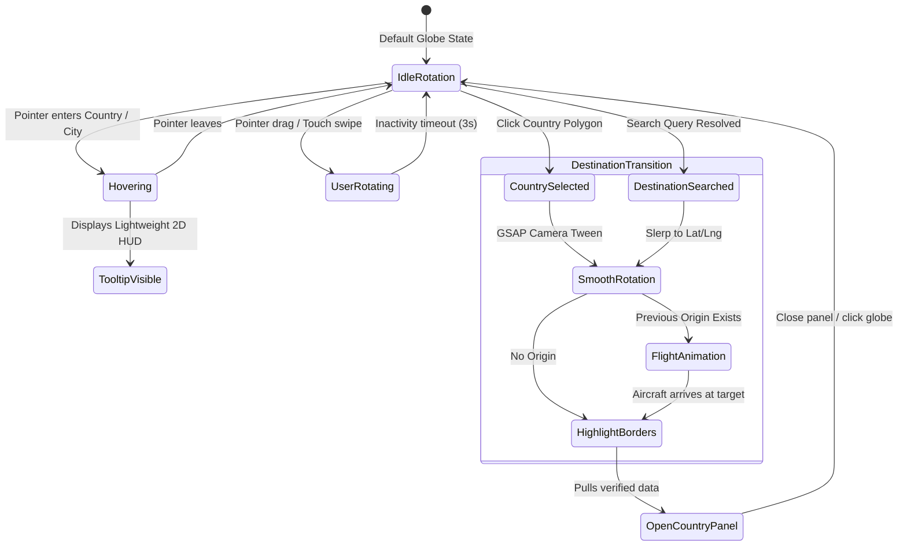

# 🌍 TripMind — Interactive 3D Globe Specification & Architecture

> **Document Status**: APPROVED SPECIFICATION  
> **Role**: AGENT 2: TRIPMIND PRODUCT ARCHITECT + SENIOR UI/UX DESIGNER  
> **Target Subsystem**: Homepage & Dashboard 3D Earth Globe Engine  
> **Companions**: [`docs/product/TRIPMIND_PRODUCT_ARCHITECTURE.md`](file:///Users/shoabbosovamuslima/Desktop/Travel%20uz/docs/product/TRIPMIND_PRODUCT_ARCHITECTURE.md), [`docs/product/TRIPMIND_UX_SPEC.md`](file:///Users/shoabbosovamuslima/Desktop/Travel%20uz/docs/product/TRIPMIND_UX_SPEC.md)  

---

## 1. Executive Summary & Design Vision

The TripMind interactive 3D Globe is the **primary anchor for global travel discovery**. Rather than functioning as a passive background video or decorative sphere, it serves as an **operational visual search engine and geographic command center**.

### Core Tenets:
1. **Photorealistic & Premium**: Avoids neon gaming aesthetics, cartoon stylizations, and excessive bloom/glow. Employs NASA Blue Marble albedo textures, normal bump mapping, specular ocean reflection, and a delicate Rayleigh-inspired atmospheric rim.
2. **Geographical Precision**: Uses real WGS84 geographic coordinate conversions (`toXYZ` via standard spherical projections) and verified GeoJSON country polygon boundary math with point-in-polygon raycasting.
3. **Interactive & Connected**: Every interaction (search, clicking a country, picking a city pin) orchestrates camera tweens, border highlighting, destination markers, and real-time flight route simulations.
4. **Authentic Data Grounding**: Country information cards present verified geopolitical facts, weather, seasonal windows, places, accommodations, dining, and agency tour packages without fabricating missing information.

---

## 2. Interaction Specifications



### 2.1 Rotation & Zoom Controls
- **Rotation**: Full 360° spherical rotation on X and Y axes via `@react-three/drei` `OrbitControls` with physics damping (`dampingFactor: 0.05`).
- **Zoom Range**: Constrained between `minDistance: 3.2` (close country inspection) and `maxDistance: 8.0` (deep space global context). Pan is disabled to preserve the globe at the scene origin `[0, 0, 0]`.
- **Auto-Rotation**: Gentle idle spin (`+0.0015 rad/frame`). Automatically pauses on pointer down, wheel, or search selection, and resumes after 3 seconds of user inactivity.

### 2.2 Country Selection & Hover Detection
- **Raycasting**: Mouse coordinates on the Three.js canvas are projected onto the spherical mesh, converted to geographic `lat` and `lng`, and tested against GeoJSON polygons (`countries.json`) via point-in-polygon bounding box filtering.
- **Hover HUD**: Displays a clean, minimal glass tooltip showing the country name, continent, and subregion without obstructing the view.
- **Click Selection**:
  - Halts auto-rotation immediately.
  - Highlights country perimeter with high-contrast 1px border.
  - Smoothly rotates the globe via GSAP tween to position the country at camera center (`fov: 45`).
  - Opens the verified `CountryInfoPanel`.

---

## 3. Search Connection & Dynamic Flight Animation

### 3.1 Search Resolution Engine
When a user searches on the homepage or top navigation (e.g., *"Uzbekistan"*, *"Cappadocia"*, *"Paris"*, *"Samarkand"*):
1. **Geocoding & Place Resolution**: Queries the verified destination/place catalog and geopolitical dictionary for exact latitude and longitude coordinates.
2. **Camera Alignment**: Calculates target Euler rotations:
   $$\theta = (\text{lon} + 180) \times \frac{\pi}{180}, \quad \phi = (90 - \text{lat}) \times \frac{\pi}{180}$$
   The globe smoothly tweens to orient the coordinates directly towards the viewer.
3. **Target Marker**: Renders a pulsing destination marker pin at the precise coordinates.

### 3.2 Geodesic Flight Route Animation
When switching from an origin to a new destination (e.g. from *Uzbekistan* to *Cappadocia*):
- **Curved 3D Arc Calculation**: Instead of a flat straight line cutting through the Earth, a 3D Quadratic Bezier Curve or Great Circle Slerp path is generated:
  - $\vec{P}_{\text{start}} = \text{toXYZ}(\text{lat}_1, \text{lon}_1, R)$
  - $\vec{P}_{\text{end}} = \text{toXYZ}(\text{lat}_2, \text{lon}_2, R)$
  - $\vec{P}_{\text{mid}} = \text{normalize}(\frac{\vec{P}_{\text{start}} + \vec{P}_{\text{end}}}{2}) \times (R + H_{\text{altitude}})$
  where $H_{\text{altitude}} = \min(1.2, \text{distance} \times 0.35)$ ensures long transcontinental flights arch higher above the atmosphere.
- **Flight Visualization**:
  - A dashed luminous route polyline tracing the arc.
  - A 3D miniature aircraft glyph that travels along the path over 2.0–2.8 seconds.
  - The aircraft aligns its forward vector along the mathematical tangent $\frac{d\vec{P}(t)}{dt}$ so it banks and points naturally in the direction of flight.
  - The globe **remains completely interactive** during and after flight (user can still zoom and rotate while the plane flies).

---

## 4. Country & Destination Information Schema

When a destination is selected, `CountryInfoPanel` renders verified real-world travel telemetry:

```typescript
interface VerifiedDestinationData {
  name: string;
  country: string;
  capital: string;
  currency: string;
  language: string;
  timezone: string;
  weather?: {
    temp: number;
    condition: 'Sunny' | 'Partly Cloudy' | 'Rainy' | 'Clear';
  };
  bestSeason?: string;
  visaStatus?: 'Visa Free' | 'eVisa Available' | 'Visa Required';
  popularDestinations: {
    name: string;
    region: string;
    image: string;
  }[];
  places: {
    name: string;
    category: string;
    entryFee?: number;
  }[];
  hotels: {
    name: string;
    rating: number;
    pricePerNight: number;
  }[];
  restaurants: {
    name: string;
    cuisine: string;
    priceRange: string;
  }[];
  tours: {
    title: string;
    durationDays: number;
    price: number;
    agencyName: string;
  }[];
}
```

> [!IMPORTANT]
> **Data Integrity Rule**: If live weather, specific hotel rates, or visa reciprocity agreements are unverified for a country, the UI explicitly omits or marks them as "Consult Embassy / Local Guide" rather than fabricating mock values.

---

## 5. Responsive Viewport Adaptations

| Viewport | Layout & Behavior |
| :--- | :--- |
| **Desktop (>= 1024px)** | Split-grid presentation: Interactive 3D Globe occupies 60% viewport width, synced with Country Info Drawer (40% width). Flight paths and aircraft orientation render at full WebGL resolution (`dpr: 1.5`). |
| **Tablet (768px – 1023px)** | Globe occupies primary hero canvas (420px height); Country Info card slides in from the bottom or renders beneath with smooth sticky anchoring. |
| **Mobile (< 768px)** | Globe renders in focused 260px–300px interactive hero card with touch rotation & pinch zoom (`dpr: 1.0` to conserve battery). Country Information renders as an expandable bottom drawer with full-bleed touch cards. |

---

*Specification authored by AGENT 2 (TripMind Product Architect + Senior UI/UX Designer).*
