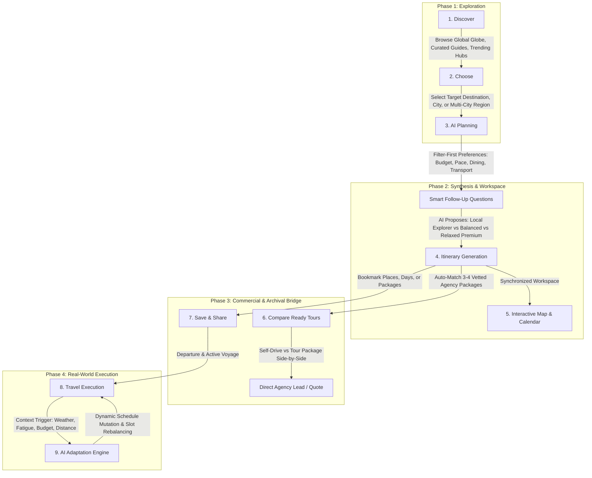
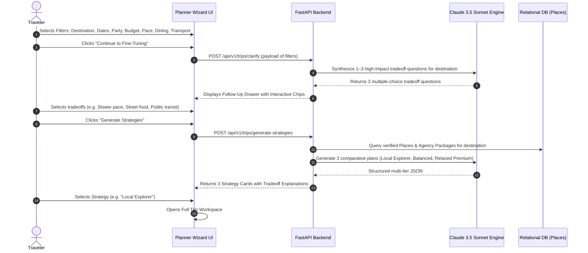

# 🌐 TripMind — Product Architecture & System Specification

> **Document Status**: APPROVED SPECIFICATION  
> **Role**: AGENT 2: TRIPMIND PRODUCT ARCHITECT + SENIOR UI/UX DESIGNER  
> **Target Version**: TripMind 2.0 (Global Traveler Experience & AI Ecosystem)  
> **Scope**: Target Product Architecture, Information Architecture, Data Flows, and Functional Subsystem Specifications  
> **Reference Audit**: [`docs/audit/TRIPMIND_CODEBASE_AUDIT.md`](file:///Users/shoabbosovamuslima/Desktop/Travel%20uz/docs/audit/TRIPMIND_CODEBASE_AUDIT.md)  
> **Constraint**: Architecture & Specification Phase — Zero Code Changes  

---

## 1. Executive Summary & Product Vision

### 1.1 From Regional Catalog to Global Autonomous Travel Platform
TripMind is a next-generation global travel planning and tour platform. While the initial prototype foundation was developed around regional destinations in Central Asia, TripMind 2.0 transitions into a **borderless, hyper-personalized, and adaptive global travel intelligence platform**.

TripMind bridges the gap between two traditionally fragmented travel worlds:
1. **Independent, Self-Directed Travelers**: Who desire hyper-personalized itineraries, real-time map routes, budget-conscious pacing, and live on-the-ground adaptations.
2. **Licensed Tour Agencies & Local Guides**: Who provide vetted, high-touch tour packages, regional logistics, and curated group travel experiences.

### 1.2 The First Major Milestone
The primary objective of Milestone 1 is the delivery of the **Traveler Experience Ecosystem**:
- A unified, modern **Traveler Dashboard**.
- The signature **Filter-First AI Travel Planner** with conversational trade-off resolution.
- The **Trip Workspace** (a synchronized List, Calendar, and Geocoded Map environment).
- The **Ready Tours Recommendation & Comparison Engine** (seamlessly bridging AI plans to agency bookings).
- An **In-Trip Contextual AI Adaptation System** for on-the-ground real-world pivots.
- A unified **Multi-Entity Saved Vault**.

---

## 2. Core Traveler Loop Architecture

The core traveler loop defines the end-to-end lifecycle of a traveler on TripMind, from initial wanderlust to post-trip memories:



### Detailed Loop Breakdown:
1. **Discover**: Traveler explores global destinations via the 3D Globe, editorial City Guides, community itineraries, or curated collections.
2. **Choose**: Traveler locks in one or multiple destinations with target seasonal dates.
3. **AI Planning**: Traveler inputs structured baseline filters (dates, party, budget, pace, comfort, food, mobility) and engages in a 1–3 question conversational calibration.
4. **Itinerary**: TripMind generates a structured multi-day plan categorized into Morning, Afternoon, and Evening slots with cost breakdowns.
5. **Map**: Activities are mapped using geocoded coordinates, calculated walking/transit routes, and neighborhood clustering.
6. **Compare Ready Tours**: The platform queries agency inventory to present 3–4 matching commercial tour packages alongside the DIY AI itinerary with objective tradeoff metrics.
7. **Save**: The traveler persists the plan to cloud storage, bookmarks individual POIs, or exports a PDF brochure.
8. **Travel**: The traveler switches to active "Travel Mode" on mobile devices with live navigation, offline caching, and real-time schedules.
9. **AI Adaptation**: Real-time life events ("It's raining", "I'm exhausted", "Budget low") trigger one-tap re-planning that dynamically mutates remaining itinerary slots without destroying booked accommodations.

---

## 3. Information Architecture (IA) & URL Routing

To fix the technical debt identified in the audit (where views were isolated in client-side component state without deep links), TripMind establishes a deterministic URL structure paired with a clean hierarchical IA.

### 3.1 Global Site Map

```
TripMind Root
│
├── / (Landing Page / Hero Globe / Global Discovery)
├── /explore (Global Destination Directory & City Guides)
│   ├── /explore/:countrySlug
│   └── /explore/:countrySlug/:citySlug
│
├── /planner (Filter-First AI Trip Generation Wizard)
│   └── /planner/draft/:draftId
│
├── /trips (Traveler's Trip Hub)
│   ├── /trips/:tripId (Trip Workspace: List / Calendar / Map)
│   ├── /trips/:tripId/compare (Workspace Itinerary vs Ready Tours Comparison)
│   └── /trips/public/:shareToken (Public Shareable View / Lead Conversion)
│
├── /tours (Ready Tours Marketplace)
│   ├── /tours/:tourId (Tour Package Detail View)
│   └── /tours/compare?ids=1,2,3 (Multi-Package Comparison Matrix)
│
├── /community (Community Trips, Public Itineraries, Guide Directory)
│   └── /community/trips/:id
│
├── /saved (Universal Bookmark Vault: Trips, Tours, Hotels, Places)
├── /profile (Traveler Profile, Preferences, Loyalty, Settings)
│
└── /agency (B2B Agency Portal - Role Guarded)
    ├── /agency/crm (Lead Pipeline Kanban)
    ├── /agency/analytics (Operational Telemetry)
    └── /agency/packages (Tour Package Catalog Management)
```

### 3.2 Navigation Structure Mapping

| View Identifier | Desktop Sidebar Rank | Mobile Bottom Nav Rank | Guard / Auth Level | Primary Purpose |
| :--- | :--- | :--- | :--- | :--- |
| **Home** | #1 (Top) | #1 (Left) | Public / Hydrated | High-level dashboard, active trip countdown, quick voyage setup, 3D Globe inspection. |
| **Explore** | #2 | #2 | Public / Hydrated | Searchable catalog of countries, cities, cultural highlights, visa regulations, and seasonal guides. |
| **AI Planner** | #3 | #3 (Center / Elevated) | Public Draft / Auth to Save | Dedicated conversational filter-first itinerary generator with 3 strategy tradeoffs. |
| **My Trips** | #4 | #4 | Authenticated | Personal travel hub with Upcoming, Active, Past, and Drafted itineraries. |
| **Tours** | #5 | Header / Drawer | Public | Vetted agency tour package marketplace with filterable group and private packages. |
| **Community** | #6 | Secondary Sub-tab | Public / Authenticated | Public community trips with join requests, verified guide directory, traveler reviews. |
| **Saved** | #7 | Header / Sub-tab | Authenticated | Unified 5-category bookmark repository (Trips, Tours, Hotels, Food, Sights). |
| **Profile** | #8 (Bottom) | #5 (Right) | Authenticated | Personal travel preferences (diet, pace, currency), security, linked accounts. |

---

## 4. Subsystem Functional Specifications

### 4.1 Global City Guide & Adaptive Localization Matrix

The TripMind UX must naturally adapt its contextual intelligence, recommendations, and interface affordances based on the active city without hardcoded regional hacks.

#### Adaptive Dimension Matrix

| Functional Dimension | Metropolitan Transit Hub (e.g., Paris, Tokyo, London) | Historic / Bazaar Hub (e.g., Samarkand, Istanbul, Marrakech) | Island / Resort Hub (e.g., Bali, Santorini, Phuket) |
| :--- | :--- | :--- | :--- |
| **Primary Transit Modality** | Metro, RER/Subway, High-Speed Rail, Walking | Licensed Taxi (Yandex/Careem), Walking, Intercity Rail | Scooter/Moped rental, Private Driver, Ferry/Speedboat |
| **Ticket Logistics** | Contactless NFC / Transit Pass, Time-slotted Museum Passes | Cash / Local Som/Lira, Guided Tour Access, Open Plaza Entry | Pier Fees, Cash at local stalls, Digital voucher QR |
| **Gastronomy Structure** | Bistro / Brasserie reservation, Michelin dining, Patisserie | Street Food / Chaykhana, Family Taverns, Tea Houses, Halal certification | Beach Club, Warung / Seafood Market, Sunset Lounges |
| **Pacing & Climate Pivot** | Rain/Cold indoor museum pivots, Winter daylight shifts | Midday heat shelter (13:00–16:00), Siesta/Tea break pacing | Tropical squall / Monsoon indoor activity alternates |
| **Cultural & Dress Etiquette** | Smart-casual dress codes in fine dining & opera | Modest dress / headwear for mausoleums, mosques, religious monuments | Temple sarong requirements, beachwear boundaries |
| **Currency & Payment Norms** | 98% Card/Apple Pay; Tipping discretionary or service included | Cash essential for bazaars; Haggling customary in craft stalls | Cash for local transport/tips; Card surcharge considerations |

#### Architectural Engine for City Adaptation:
Instead of static code rules, the backend provides an `AdaptiveCityProfile` object attached to each destination:
```typescript
interface AdaptiveCityProfile {
  transitDefaults: {
    recommendedModalities: ('metro' | 'taxi' | 'walking' | 'scooter' | 'boat')[];
    transitPassName?: string;
    rideHailingApps: string[];
    paymentGuidance: string;
  };
  etiquetteTips: {
    dressCodeSummary: string;
    tippingNorms: string;
    bargainingCustom: boolean;
    religiousNorms?: string[];
  };
  currencyContext: {
    localCurrencyCode: string;
    cashNecessityIndex: 'low' | 'moderate' | 'high' | 'exclusive';
    commonExchangeLocations: string;
  };
  climatePacing: {
    siestaRecommended: boolean;
    peakHeatHours?: [number, number];
    indoorRainAlternatives: string[];
  };
}
```

---

### 4.2 Traveler Dashboard Subsystem

The Traveler Dashboard serves as the central operational cockpit. It balances inspirational discovery with practical trip management.

#### Key Dashboard Modules:
1. **Hero Context Banner**:
   - If user has an **Active Trip** (today falls within trip dates): Displays **"Live Trip Mode: Day X in [City]"** with current time slot card, quick weather alert, and "Open In-Trip Copilot" button.
   - If user has an **Upcoming Trip**: Displays an elegant countdown card with destination weather forecast, packing checklist link, and quick itinerary view.
   - If user has **No Active Trips**: Displays the **"Quick Voyage Setup"** search widget over the interactive 3D Globe with trending seasonal stops.
2. **Interactive 3D Globe Engine**:
   - Displays real-time day/night terminator line.
   - Pin markers for user's past trips, bucket list bookmarks, and trending global destinations.
   - Click-to-inspect country modal rendering visa status, local currency, emergency lines, and top attractions.
3. **Trending Global Collections**:
   - Curated cards: "Autumn in Kyoto", "The Silk Road Journey", "Amalfi Coastal Drive", "Patagonia Trekking".
   - Each card exposes duration, estimated budget in user's currency, and "Generate Similar Trip" trigger.
4. **Service Shortcuts & Utility Bar**:
   - Currency switcher (USD, EUR, UZS, GBP, JPY) with instant real-time client re-calculation.
   - Emergency Consular & Tourist Police directory based on active location.

---

### 4.3 Filter-First AI Planner & Follow-Up Engine

The AI Planner rejects the "blank text box" paradigm in favor of a structured, filter-first wizard followed by conversational micro-tuning.



#### Step 1: Filter-First Inputs
- **Destination**: Search with autocomplete across global cities, regions, and multi-city loops.
- **Dates / Duration**: Date range picker or flexible duration slider (1–30 days).
- **Travel Party**: Solo, Couple, Family with Kids, Group of Friends.
- **Total Budget & Currency**: Interactive slider with preset brackets ($ / $$ / $$$ / $$$$) anchored to user's currency.
- **Pace Preference**:
  - *Leisurely*: 1–2 key highlights per day, extended cafe breaks.
  - *Balanced*: 2–3 highlights with comfortable transition windows.
  - *Fast-Paced / Max Sights*: 4+ sights per day, early morning starts.
- **Comfort Level**: Backpacker / Hostel, Mid-scale 3-star / Boutique, Luxury 5-star / Heritage Suites.
- **Interests**: Multi-select pills (History & Monuments, Local Gastronomy, Architecture, Nature & Hikes, Nightlife, Artisan Crafts, Photography).
- **Food Preferences**: Street Food & Markets, Traditional Chaykhanas/Trattorias, Halal, Vegetarian/Vegan, Fine Dining.
- **Transport Preference**: Walking & Metro/Transit, Taxi/Rideshare, Rental Car, Private Chauffeur.

#### Step 2: 1–3 Smart Follow-Up Questions (Conversational Calibration)
Rather than asking generic questions, the engine prompts the user with destination-specific tradeoffs.
*Example: Destination = Istanbul, 5 Days, 2 Travelers, $400, Culture + Food:*
1. **Pacing Tradeoff**: *"Do you prefer covering both the European historic core (Sultanahmet) and vibrant Asian side (Kadikoy), or spending deeper time in historic Sultanahmet and Beyoglu?"*  
   - Options: `[Cover Both Continents]` vs `[Focus European Side Only]`
2. **Gastronomy Tradeoff**: *"Istanbul has legendary street food and upscale Bosphorus waterfront dining. What sounds best?"*  
   - Options: `[Street stalls, Simit & Fish sandwiches]` vs `[Balanced authentic Lokantas]` vs `[Bosphorus view restaurants]`
3. **Transit Tradeoff**: *"The city has scenic ferries and crowded tramlines, while taxis can get stuck in heavy bridge traffic. How do you want to move?"*  
   - Options: `[Ferries & Public Transit]` vs `[Yellow Taxis / Uber]` vs `[Walking Intensive]`

#### Step 3: Tri-Tier Strategy Generation
The engine synthesizes three distinct, viable trip strategies:
1. **Local Explorer (Authentic & Budget-Optimized)**:
   - Prioritizes public transit, walking alleys, neighborhood food markets, free-admission architectural marvels, and authentic cultural encounters.
2. **Balanced (The Curated Benchmark)**:
   - The optimal blend of marquee landmarks, skip-the-line museum admissions, comfortable mid-tier boutique stays, and reliable transit options.
3. **Relaxed Premium (High Comfort & Leisure)**:
   - Includes private transfers, premium guided experiences, reservation-only heritage dining, and built-in relaxation buffers.

The user selects one strategy as their working baseline or modifies individual parameters before entering the Workspace.

---

### 4.4 Trip Workspace Subsystem (List, Calendar, Map)

The Trip Workspace is the operational heart of TripMind. It replaces static timelines with a responsive, synchronized multi-view environment.

```
┌─────────────────────────────────────────────────────────────────────────────────────────────┐
│ 🗺️ TRIP WORKSPACE: "Samarkand & Bukhara Silk Road Odyssey"                                 │
│ 📅 Oct 12 – Oct 17, 2026 (6 Days) • 👥 2 Travelers • 💰 $1,450 / $1,600 Est • 📍 Samarkand │
├──────────────────────────────────────┬──────────────────────────────────────────────────────┤
│ VIEW TABS: [📋 Timeline] [📅 Calendar] [🗺️ Map View]    ACTIONS: [Export PDF] [Share] [Live]│
├──────────────────────────────────────┼──────────────────────────────────────────────────────┤
│ DAY SELECTOR: [Day 1] [Day 2*] [Day 3] [Day 4] [Day 5] [Day 6]     [+ Add Day]              │
├──────────────────────────────────────┬──────────────────────────────────────────────────────┤
│ LEFT PANEL: ITINERARY SCHEDULE       │ RIGHT PANEL: SYNCHRONIZED MAP & GEO-ROUTING          │
│                                      │                                                      │
│ 🌅 MORNING (09:00 - 12:30)           │  ┌────────────────────────────────────────────────┐  │
│ ┌──────────────────────────────────┐ │  │ [1] Registan Square                           │  │
│ │ 🏛️ Registan Ensemble             │ │  │       │                                         │  │
│ │ 📍 Samarkand Center              │ │  │   🚶 12 min walk (950m)                         │  │
│ │ ⏱️ 2.5 hrs • 💰 65,000 UZS       │ │  │       ▼                                         │  │
│ │ ⭐ 4.9 (1,240 reviews)           │ │  │ [2] Bibikhanum Teahouse                        │  │
│ │ 🛡️ Verified POI • Open 08:00-19:00│ │  │       │                                         │  │
│ └──────────────────────────────────┘ │  │   🚶 4 min walk (250m)                          │  │
│   │ 🚶 12 min walk (950m)            │ │  │       ▼                                         │  │
│   ▼                                  │ │  │ [3] Siab Bazaar                              │  │
│ 🍽️ LUNCH (12:30 - 14:00)             │ │  │                                              │  │
│ ┌──────────────────────────────────┐ │  │  Google Maps WebGL Canvas with:               │  │
│ │ 🍲 Bibikhanum Chaykhana          │ │  │  • Numbered sequential route pins               │  │
│ │ 📍 Tashkent St • Traditional Plov│ │  │  • Real walking & transit polylines            │  │
│ │ 💰 $8-12 / person • ⭐ 4.7        │ │  │  • Interactive POI hover telemetry              │  │
│ └──────────────────────────────────┘ │  └────────────────────────────────────────────────┘  │
│                                      │                                                      │
│ ☀️ AFTERNOON (14:00 - 17:30)         │ READY TOURS MATCH (3 Packages Available):            │
│ ┌──────────────────────────────────┐ │ ┌──────────────────────────────────────────────────┐ │
│ │ 🏺 Siab Folk Bazaar Exploration  │ │ │ 🏷️ Silk Road Heritage Express (Marakanda Tours)  │ │
│ │ 📍 Bibikhanum Gate               │ │ │ 💰 $520 • 🏨 4-Star Boutique • 🚗 High-Speed Rail│ │
│ │ ⏱️ 2 hrs • 💰 Free Entry         │ │ │ 🛡️ 94% Itinerary Match • [Compare] [Contact]     │ │
│ └──────────────────────────────────┘ │ └──────────────────────────────────────────────────┘ │
└──────────────────────────────────────┴──────────────────────────────────────────────────────┘
```

#### 4.4.1 Workspace Header
- **Trip Title & Tagline** (Editable inline).
- **Key Telemetry Chips**: Destination, Date Range, Traveler Count, Budget Health Indicator (Estimated vs Limit with currency selector).
- **View Switcher**: Segmented toggle between **Timeline (List)**, **Calendar**, and **Full Map**.
- **Action Bar**:
  - `Export PDF Brochure` (Invokes backend ReportLab generator).
  - `Share Public Itinerary` (Generates secure 12-char token link).
  - `Enter In-Trip Mode` (Switches mobile shell to live voyage copilot).
  - `Matching Ready Tours` (Badge indicating number of vetted agency matches).

#### 4.4.2 Day Slots Structure
Every day is organized into explicit, collapsible time blocks:
1. **Morning Block** (Typically 08:30 – 12:30): Cultural monuments, active exploration, museum visits.
2. **Lunch / Gastronomy Break** (12:30 – 14:00): Curated local dining spots near the morning activity.
3. **Afternoon Block** (14:00 – 17:30): Artisan shopping, bazaars, secondary sights, scenic viewpoints.
4. **Evening / Dinner Block** (17:30 – 21:30): Sunset spots, specialty dining, nightlife, cultural shows.
5. **Night Lodging Stay**: Recommended or booked hotel node with check-in details and neighborhood info.

#### 4.4.3 Activity Card Data Schema
Each activity card displays rich, structured metadata:
- **Category Badge**: Attraction, Restaurant, Cafe, Transit Leg, Shopping, Entertainment, Rest Slot.
- **Timing & Duration**: Scheduled start time and recommended dwell time.
- **Pricing & Currency**: Entrance fee or estimated meal cost in user's active currency.
- **Rating & Social Proof**: Star rating and review count from verified traveler catalog.
- **Operating Hours**: Live status badge ("Open Now", "Closes at 18:00", "Closed on Mondays").
- **Transit Interstitial**: Distance to next node, travel duration, and recommended transit method (Walking, Metro line, Taxi).
- **Verification Tier**: Explicit badge distinguishing **Verified Place** (grounded in DB) vs **AI Suggestion** (heuristic recommendation).
- **Node Action Menu**: Edit details, Reorder (drag & drop), Delete, Replace with nearby alternative, Open in external maps.

---

### 4.5 Ready Tours Recommendation & Match Engine

TripMind addresses a major travel pain point: travelers often invest hours crafting a self-guided itinerary, only to realize that arranging transport, hotels, and permits independently is exhausting or more expensive than an agency package.

#### Recommendation Flow:
1. When an itinerary is created or viewed, the backend queries the `Package` database for verified agency offerings matching:
   - Same primary destination or country circuit.
   - Overlapping duration (±2 days).
   - Compatible budget range (within 35% of calculated itinerary budget).
2. The system computes a **Match Score (0–100%)** based on:
   - Sights overlap: Percentage of itinerary POIs covered in package.
   - Pacing similarity: Matching travel style (Relaxed vs Active).
   - Transportation & hotel grade alignment.
3. The workspace displays **"Trips You May Prefer"** featuring 3–4 vetted agency package cards.

#### Package Card Specification:
- **Agency Header**: Agency Name, Verified Agency Badge, Trust Rating (e.g., 4.9 ★ from 380 reviews).
- **Package Title & Duration**: E.g., *"Treasures of Samarkand & Bukhara — 5 Days / 4 Nights"*.
- **All-Inclusive Price**: Displayed per person in user's preferred currency (e.g., *$540 / traveler*).
- **Inclusion Checklist**:
  - 🏨 Hotel: E.g., *4-Star Heritage Boutique Hotels with breakfast*.
  - 🚗 Transport: E.g., *High-speed Afrosiyob rail tickets + private AC minivan transfers*.
  - 🍽️ Meals: E.g., *Daily breakfast + 3 authentic gastronomy dinners included*.
  - 👤 Guide: E.g., *Licensed English/German-speaking Silk Road cultural historian*.
- **Match Explanation Pill**: E.g., *"92% Match: Covers Registan, Siab Bazaar & Shah-i-Zinda with zero transport hassle."*
- **Primary Actions**:
  - `Compare Side-by-Side`: Launches the comparative matrix modal.
  - `Contact Agency / Request Quote`: Triggers the direct inquiry modal, immediately creating a CRM Lead in the agency's dashboard.

---

### 4.6 Side-by-Side Comparison Architecture

The Comparison Subsystem allows travelers to compare their custom AI itinerary directly against agency packages, or compare two agency packages against each other.

#### Comparison Matrix Dimensions:

```
┌──────────────────────────────┬──────────────────────────────┬──────────────────────────────┐
│ Comparison Dimension         │ Your Custom AI Itinerary     │ Agency Package: Silk Road Pro│
├──────────────────────────────┼──────────────────────────────┼──────────────────────────────┤
│ 🏷️ Total Est. Cost (2 Guests)│ $1,180 (Self-Pay as you go)  │ $1,340 ($670 / traveler)     │
│ 🚗 Logistics & Transit       │ Self-managed taxis & walking │ Private AC vehicle + Rail    │
│ 🏨 Accommodation             │ Self-booked via booking links│ Included (Pre-reserved 4★)   │
│ 🎫 Sight Admissions          │ Stand in queues / pay on site│ VIP Skip-the-Line included   │
│ 👤 Cultural Guidance         │ Self-guided AI audio/notes   │ Dedicated licensed historian │
│ 🛡️ Flexibility               │ 100% Freeform & modifiable   │ Fixed daily group schedule   │
│ ⚠️ Effort Required           │ High (Handling tickets/maps) │ Zero (All logistics handled) │
│ 💬 Direct Booking Channel    │ Multiple third parties       │ 1-Click direct agency escrow │
└──────────────────────────────┴──────────────────────────────┴──────────────────────────────┘
```

The comparison highlights cost differences, logistical friction, and flexibility tradeoffs, giving the traveler full autonomy to choose self-guided execution or professional agency support.

---

### 4.7 Travel AI: In-Trip Real-Time Adaptation Engine

When a traveler is actively on the ground, circumstances change rapidly. The In-Trip Copilot provides rapid one-tap entry points to adapt the day's remaining schedule without breaking the overall trip.

#### Core Adaptation Entry Points:

| Trigger Prompt | Contextual Diagnosis | AI Schedule Mutation Response |
| :--- | :--- | :--- |
| **"I'm tired"** | High fatigue, high walking mileage already recorded. | Removes afternoon high-exertion walking tour; substitutes a scenic 2-hour tea house lounge or relaxing hammam/spa; shifts dinner to hotel vicinity. |
| **"It's raining"** | Adverse weather conditions detected or reported. | Swaps open-air parks and walking squares for indoor museums, historic covered bazaars, art galleries, and craft workshops. |
| **"I only have $40 left today"** | Budget constraint emergency. | Replaces high-end dining recommendation with authentic street food / family lokanta; flags free-admission monuments for the evening slot. |
| **"Find cheap local food near me"** | Geolocation proximity query. | Scans 800m radius of traveler's current GPS coordinates for verified authentic dishes with pricing under $6. |
| **"Is this museum open today?"** | Operating schedule check. | Validates current day against database operating hours; warns if closing within 45 minutes; suggests immediate nearby alternative if closed. |
| **"Move activities closer"** | Transit fatigue / traffic gridlock. | Clusters afternoon and evening activities into a single tight geographic radius (< 1km) to eliminate cross-city transport legs. |

#### State Mutation Rules:
- The adaptation engine **never** deletes future day plans or reserved hotel nights.
- It only alters remaining uncompleted slots for the **current day**.
- All adjustments present a diff preview: *"Replace Walking Tour with Siab Tea Pavilion? [Apply Changes] [Keep Original]"*.

---

### 4.8 Multi-Entity Saved / Bookmark Vault

The Saved subsystem is upgraded from a client-side localStorage array into a full relational repository supporting five distinct entity types:

```
Saved Vault (/saved)
│
├── 📂 Trips (Saved AI itineraries, customized drafts, shared friend trips)
├── 🏷️ Tours (Bookmarked agency packages for future seasons)
├── 🏨 Lodging (Hotels, traditional guest houses, boutique suites)
├── 🍽️ Gastronomy (Restaurants, tea houses, street food stalls, cafes)
└── 🏛️ Attractions (Monuments, museums, viewpoints, architectural wonders)
```

#### Capabilities:
- Filter by destination city or category.
- Drag any saved attraction or restaurant directly into an open Day Slot in the Trip Workspace.
- Share saved collections with travel companions via private share link.
- Synchronized between mobile and desktop via `/api/v1/trips/saved/all` and `/api/v1/destinations/saved/all`.

---

## 5. Backend Alignment & API Contract Mapping

To ensure seamless implementation without architectural friction, the product specifications map directly to existing and extended FastAPI endpoints.

| Feature Area | Endpoint & Method | Status in Codebase | Required Enhancements |
| :--- | :--- | :--- | :--- |
| **User Profile & Preferences** | `GET /api/v1/auth/me`<br>`PATCH /api/v1/auth/profile` | Exists in schema | Persist traveler dietary preferences, mobility, currency. |
| **AI Planner Clarification** | `POST /api/v1/trips/clarify` | New endpoint | Synthesizes 1–3 smart follow-up questions via Claude Sonnet. |
| **AI Multi-Strategy Generation** | `POST /api/v1/trips/generate` | Exists in `trips.py` | Update schema to generate 3 strategies and return verified place links. |
| **Trip Workspace CRUD** | `GET /api/v1/trips/{id}`<br>`PUT /api/v1/trips/{id}` | Exists in `trips.py` | Correct untyped body parameter (`trip_in: TripCreate`). |
| **Ready Tours Recommendations** | `GET /api/v1/packages/match` | New endpoint | Query packages matching destination & budget with match score. |
| **Agency Lead Submission** | `POST /api/v1/leads/public` | Exists in `leads.py` | Dispatches lead to agency CRM Kanban board and Telegram worker. |
| **In-Trip Schedule Mutation** | `POST /api/v1/trips/{id}/adapt` | New endpoint | Takes current slot + trigger prompt, mutates day's remaining activities. |
| **Universal Saved Vault** | `GET /api/v1/saved/all`<br>`POST /api/v1/saved/{entity}/{id}` | Exists partially | Consolidate bookmarks across trips, packages, places into unified router. |
| **PDF Brochure Compilation** | `GET /api/v1/trips/{id}/pdf` | Exists in `trips.py` | Add agency matching badge and branding options. |

---

## 6. Architectural Risk & Mitigation Strategy

1. **LLM Cost & Latency on Clarification Flows**:
   - *Risk*: Multiple LLM calls (clarification questions + 3 strategy generation) increase latency and API token consumption.
   - *Mitigation*: Cache common destination clarification templates (e.g., standard questions for Paris, Tokyo, Istanbul, Samarkand). Only call Claude for non-cached custom regions.
2. **POI Geocoding Accuracy**:
   - *Risk*: Hallucinated coordinates displace map pins into water bodies or incorrect districts.
   - *Mitigation*: Enforce a strict hybrid rule: All marquee attractions must bind to verified `Place` database coordinates; unvetted AI suggestions must query Google Geocoding API before map plotting.
3. **Data Loss During In-Trip Mutation**:
   - *Risk*: Traveler triggers "I'm tired" and inadvertently wipes a pre-booked paid activity.
   - *Mitigation*: Flag pre-paid/booked nodes as "locked"; AI adaptation only reorganizes flexible exploration nodes and explicitly prompts for confirmation.

---

*Specification authored by AGENT 2 (TripMind Product Architect + Senior UI/UX Designer).*
